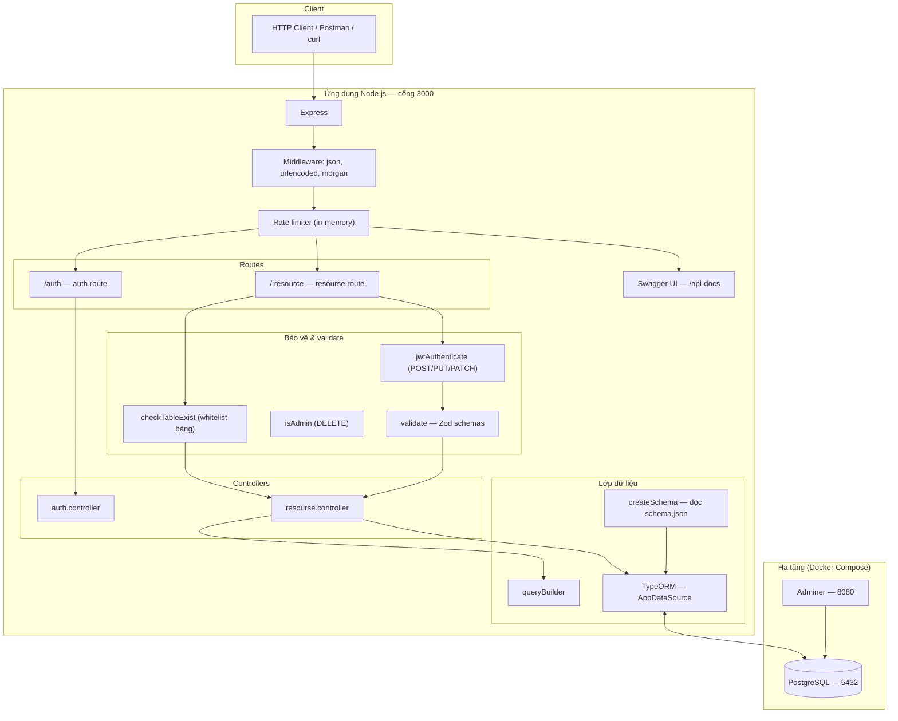

# Smart API Hub — NodeJS Long Assignment

Nền tảng REST API động: đọc `schema.json`, tự đồng bộ cấu trúc PostgreSQL (TypeORM), cung cấp CRUD động, bộ lọc/phân trang, quan hệ expand/embed, xác thực JWT, Swagger UI và giới hạn tốc độ (rate limiting).

---

## Kiến trúc hệ thống

Sơ đồ dưới đây mô tả luồng chính: client gọi Express, middleware xử lý, router tách `/auth` và tài nguyên động `/:resource`, controller + TypeORM truy vấn PostgreSQL. Dữ liệu mô hình được sinh từ `schema.json` khi khởi động.



**Ghi chú ngắn**

- `GET /health` không nằm trong nhánh JWT; các thao tác ghi (`POST` / `PUT` / `PATCH`) cần token; `DELETE` chỉ role `admin`.
- Khởi động: `connectDB` gọi `createSchemas()` từ `schema.json`, `TypeORM` `synchronize: true` (trong mã hiện tại còn `dropSchema: true` — mỗi lần chạy có thể xóa và tạo lại schema; chỉ nên dùng khi phát triển).

---

## Yêu cầu môi trường

| Thành phần | Phiên bản gợi ý |
|------------|-----------------|
| Node.js | ≥ 20 |
| npm | đi kèm Node |
| PostgreSQL | ≥ 15 (khi chạy local không dùng Docker) |
| Docker & Docker Compose | tùy chọn, khuyến nghị cho môi trường giống production |

---

## Cách 1: Chạy bằng Docker Compose (khuyến nghị)

Dự án dùng `docker-compose.yml`: PostgreSQL, Adminer và service `app` (Node 20, mount mã nguồn, `npm install` + `npm run dev`).

### Bước 1 — Chuẩn bị file môi trường

Tạo file `.env` tại thư mục gốc dự án (Compose dùng `env_file: .env`). Tối thiểu có thể đặt như sau (khớp với service `postgres` trong compose):

```env
DB_TYPE=postgres
DB_HOST=postgres
DB_PORT=5432
DB_USER=postgres
DB_PASSWORD=postgres
DB_NAME=postgres_db

JWT_ACCESS_SECRET_KEY=your-secret-key-must-be-32-chars!!
JWT_REFRESH_SECRET_KEY=your-secret-key-must-be-32-chars!!
ENCRYPTION_KEY=your-secret-key-must-be-32-chars!!

# Tùy chọn
# JWT_ACCESS_EXPIRES=15m
# JWT_REFRESH_EXPIRES=7d
# BCRYPT_ROUNDS=10
```

**Lưu ý:** Không commit file `.env` lên Git. Các khóa JWT/encryption nên là chuỗi đủ mạnh (ví dụ ≥ 32 ký tự theo convention trong code).

### Bước 2 — Khởi động

Trong thư mục gốc dự án:

```bash
docker compose up --build
```

Hoặc chạy nền:

```bash
docker compose up -d
```

### Bước 3 — Kiểm tra

| URL / cổng | Mục đích |
|------------|----------|
| [http://localhost:3000/health](http://localhost:3000/health) | Kiểm tra API + kết nối DB |
| [http://localhost:3000/api-docs](http://localhost:3000/api-docs) | Swagger UI |
| [http://localhost:8080](http://localhost:8080) | Adminer (PostgreSQL: host `postgres`, user/password/db như trong compose) |
| `localhost:5432` | PostgreSQL (nếu cần kết nối từ máy host) |

Dừng stack:

```bash
docker compose down
```

---

## Cách 2: Chạy trực tiếp trên máy (local)

### Bước 1 — Cài PostgreSQL và tạo database

Tạo database (ví dụ `postgres_db`) và user khớp với biến môi trường.

### Bước 2 — Cấu hình `.env`

Đặt `DB_HOST=localhost` (hoặc địa chỉ instance PostgreSQL của bạn). Các biến còn lại tương tự mục Docker; bắt buộc có khóa JWT và `ENCRYPTION_KEY` nếu không dùng giá trị mặc định trong code.

### Bước 3 — Cài dependency và chạy

```bash
# Mở terminal tại thư mục gốc dự án (cùng cấp với package.json)
npm install
```

Chạy production-style (tsx):

```bash
npm start
```

Hoặc chế độ phát triển (nodemon + tsx):

```bash
npm run dev
```

Server lắng nghe **cổng 3000** (xem `src/server.ts`).

### Bước 4 — Build TypeScript (tùy chọn)

```bash
npm run build
```

Lệnh này chạy `tsc` theo `package.json`; entry hiện tại vẫn thường dùng `tsx` để chạy trực tiếp `src/server.ts`.

---

## Biến môi trường tham chiếu

| Biến | Ý nghĩa | Mặc định trong code (nếu thiếu) |
|------|---------|----------------------------------|
| `DB_TYPE` | Loại DB TypeORM | `postgres` |
| `DB_HOST` | Host PostgreSQL | `localhost` |
| `DB_PORT` | Cổng | `5432` |
| `DB_USER` / `DB_PASSWORD` / `DB_NAME` | Thông tin đăng nhập DB | `postgres` / `postgres` / `postgres_db` |
| `JWT_ACCESS_SECRET_KEY` / `JWT_REFRESH_SECRET_KEY` | Ký & verify JWT | Chuỗi mẫu 32 ký tự |
| `JWT_ACCESS_EXPIRES` / `JWT_REFRESH_EXPIRES` | Thời hạn token | `15m` / `7d` |
| `ENCRYPTION_KEY` | Mã hóa payload trong JWT | Chuỗi mẫu 32 ký tự |
| `BCRYPT_ROUNDS` | Vòng bcrypt | `10` |

---

## Tài liệu API & tài nguyên khác

- **Swagger:** [http://localhost:3000/api-docs](http://localhost:3000/api-docs) — mô tả endpoint từ `src/docs/swagger.yaml`.
- **Postman:** xuất/nộp bộ collection theo yêu cầu bài (nếu có trong repo).
- **Schema động:** chỉnh `schema.json` ở thư mục gốc; khởi động lại app để TypeORM đồng bộ (lưu ý `dropSchema` khi dev).

---

## Cấu trúc thư mục (rút gọn)

```
├── schema.json              # Định nghĩa bảng & seed
├── docker-compose.yml
├── Dockerfile
├── package.json
└── src/
    ├── server.ts
    ├── configs/connectDB.ts
    ├── routes/
    ├── controllers/
    ├── middlewares/
    ├── utils/
    └── docs/
```

---
